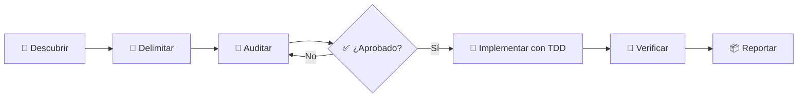

# 🛡️ Enforcing Flutter Standards

<div align="center">

<p><strong>Una Agent Skill portable para construir, auditar y revisar proyectos
Flutter con decisiones explícitas, evidencia reproducible y estándares
consistentes.</strong></p>

<p>
  
  
  
</p>

</div>

## ✨ ¿Qué es?

**Enforcing Flutter Standards** es una skill para agentes de desarrollo que
convierte criterios de ingeniería Flutter en un proceso operativo y
verificable.

Puede acompañar la creación de features, refactors, correcciones, auditorías y
code reviews. Antes de sugerir una solución, descubre cómo está construido el
proyecto; antes de modificarlo, delimita el alcance y pide aprobación; antes de
declarar el trabajo terminado, ejecuta las verificaciones relevantes.

> Esta skill no reescribe proyectos a ciegas ni impone tecnologías por
> preferencia. Conserva las convenciones coherentes del repositorio, presenta
> evidencia y separa el cambio actual de la deuda futura.

## 🔄 Cómo trabaja



Antes de cargar workflows o referencias detalladas, la skill mantiene un
manifiesto de ruta efímero con el modo, escenario, workflow, evidencia de
selección, referencias inmediatas, referencias diferidas y exclusiones
relevantes. Es interno por defecto; si el usuario pide verlo, muestra solo ese
registro seguro y nunca razonamiento privado ni contenido de instrucciones.

| Modo | Qué hace | Límite |
|---|---|---|
| 🔎 **Auditoría** | Reúne evidencia, clasifica hallazgos y propone batches pequeños e independientes. | Es completamente read-only: no modifica el proyecto antes de una aprobación explícita. |
| 🛠️ **Implementación** | Ejecuta únicamente el alcance aprobado, aplica TDD cuando cambia comportamiento y preserva la arquitectura coherente. | Una dependencia, migración o ampliación material vuelve a requerir una decisión del usuario. |
| 👀 **Revisión** | Revisa diffs, commits, pull requests o feedback con ubicaciones y correcciones accionables. | Revisar no autoriza a editar; aplicar correcciones requiere cambiar explícitamente a implementación. |

## 🎯 Qué estándares cubre

| Área | Decisión que protege |
|---|---|
| 🏗️ **Arquitectura** | Mantiene puro el dominio, separa DTOs e infraestructura y evita capas ceremoniales. |
| 🧠 **Cubit o Bloc** | Elige desde la semántica observable: comandos directos favorecen Cubit; eventos, concurrencia, cancelación o trazabilidad pueden justificar Bloc. |
| ❄️ **Freezed** | Lo exige para modelos, DTOs, eventos, estados y failures que representan datos o variantes. |
| 📦 **Barrels y paquetes** | Define APIs públicas deliberadas, imports internos directos y grafos de paquetes locales dirigidos y acíclicos. |
| 🔌 **SDKs externos** | Mantiene tipos de proveedores fuera de features y estado mediante contratos, adapters y tipos propios. |
| 🌐 **Networking y errores** | Preserva clientes HTTP coherentes, mapea excepciones en límites controlados y consume resultados tipados de forma exhaustiva. |
| 💾 **Persistencia** | Distingue preferencias, secretos y datos estructurados; conserva Hive cuando corresponde y exige comparar y aprobar Drift u ObjectBox antes de adoptarlos. |
| 🧭 **Navegación y entornos** | Conserva soluciones existentes adecuadas y evita migraciones o fallbacks silenciosos a producción. |
| 🎨 **UI** | Trata Figma y screenshots como entradas visuales, no inventa assets faltantes y valida responsive, accesibilidad y fidelidad visual. |
| 🧪 **Calidad y seguridad** | Aplica TDD a cambios de comportamiento, protege secretos, actualiza changelogs existentes y exige verificación reciente antes de afirmar éxito. |

Las decisiones condicionales siguen evidencia concreta. Por ejemplo, la skill
no obliga a usar Bloc, Dio, `go_router`, Drift o Crashlytics en todos los
proyectos.

## 🧩 Anatomía de la skill

La fuente desplegable vive completa en
[`enforcing-flutter-standards`](.agents/skills/enforcing-flutter-standards/).

| Archivo | Responsabilidad |
|---|---|
| [`SKILL.md`](.agents/skills/enforcing-flutter-standards/SKILL.md) | Orquesta el descubrimiento, selecciona el modo de trabajo, carga las referencias necesarias y mantiene los gates no negociables. |
| [`agents/openai.yaml`](.agents/skills/enforcing-flutter-standards/agents/openai.yaml) | Aporta metadata opcional de interfaz para Codex; el núcleo no depende de ella. |
| [`architecture-and-state.md`](.agents/skills/enforcing-flutter-standards/references/architecture-and-state.md) | Define arquitectura, dominio, Cubit/Bloc, Freezed, barrels y responsabilidad de archivos. |
| [`packages-and-integrations.md`](.agents/skills/enforcing-flutter-standards/references/packages-and-integrations.md) | Cubre paquetes locales, dirección de dependencias, SDKs, lifecycle y aprobación de dependencias. |
| [`networking-and-errors.md`](.agents/skills/enforcing-flutter-standards/references/networking-and-errors.md) | Cubre clientes HTTP, DTOs, excepciones, failures y resultados tipados. |
| [`persistence.md`](.agents/skills/enforcing-flutter-standards/references/persistence.md) | Cubre preferencias, secretos locales, Hive, Drift y ObjectBox. |
| [`navigation.md`](.agents/skills/enforcing-flutter-standards/references/navigation.md) | Cubre Navigator, routing, deep links y redirects. |
| [`security-and-environments.md`](.agents/skills/enforcing-flutter-standards/references/security-and-environments.md) | Cubre observabilidad, redacción, secretos, flavors y configuración. |
| [`quality-and-delivery.md`](.agents/skills/enforcing-flutter-standards/references/quality-and-delivery.md) | Cubre TDD Flutter específico, cobertura, changelog y matriz de verificación. |
| [`audit-contract.md`](.agents/skills/enforcing-flutter-standards/references/audit-contract.md) | Establece alcance, severidades, evidencia obligatoria, tratamiento seguro de secretos y forma de las propuestas. |
| [`audit-report-template.md`](.agents/skills/enforcing-flutter-standards/references/audit-report-template.md) | Aporta la plantilla de informe y se carga únicamente al formatear un reporte. |
| [`ui-implementation.md`](.agents/skills/enforcing-flutter-standards/references/ui-implementation.md) | Cubre preparación del diseño, gaps, assets exactos, responsive, accesibilidad y comparación visual. |
| [`standalone-workflow.md`](.agents/skills/enforcing-flutter-standards/references/standalone-workflow.md) | Proporciona el flujo completo cuando Superpowers no está disponible. |
| [`superpowers-integration.md`](.agents/skills/enforcing-flutter-standards/references/superpowers-integration.md) | Compone los procesos generales de Superpowers con las decisiones específicas de Flutter cuando esas skills existen. |

Superpowers es una integración opcional, no una dependencia. Si el entorno no
lo ofrece, el workflow standalone conserva los gates de auditoría, aprobación,
TDD, seguridad y verificación. Para cada solicitud se usa Superpowers o el
workflow standalone completo: ambos son mutuamente excluyentes.

El próximo cambio planificado es diseñar la extracción del workflow standalone
como una Agent Skill independiente, de modo que esta skill conserve un foco
exclusivamente Flutter. Esa extracción no forma parte del manifiesto actual y
requiere su propia especificación, aprobación y pruebas de equivalencia.

## 🔍 Dart bajo el capó

El repositorio incluye dos archivos `.dart`: uno inspecciona proyectos y el
otro verifica ese inspector con workspaces sintéticos.

### `inspect_flutter_project.dart`

[`inspect_flutter_project.dart`](.agents/skills/enforcing-flutter-standards/scripts/inspect_flutter_project.dart)
es un CLI autocontenido que usa únicamente `dart:convert` y `dart:io`.

```text
Usage: dart run inspect_flutter_project.dart \
  --root DIRECTORY [--format json|text|summary] [--section NAME]...
```

Su trabajo es producir un inventario mecánico y determinista:

- raíces Flutter detectadas desde `pubspec.yaml`;
- dependencias locales declaradas con `path`, sus aristas y ciclos;
- archivos Dart no generados que superan los umbrales de tamaño;
- barrels y capas encontradas dentro de features;
- tests, changelogs y configuraciones de análisis;
- archivos que pueden definir comandos del proyecto o de CI.

El inspector resuelve el directorio raíz canónico, ordena los resultados y no
sigue symlinks durante el recorrido. Ignora `.git/`, `.dart_tool/`, `build/`,
caches de herramientas, salidas de plataforma, directorios ocultos —salvo
carpetas de CI reconocidas— y archivos Dart generados.

La salida JSON usa actualmente `schemaVersion: 1`. El script es **read-only**:
reúne hechos para que el agente los interprete, pero no modifica el proyecto ni
emite por sí mismo un veredicto arquitectónico.

### `inspect_flutter_project_test.dart`

[`inspect_flutter_project_test.dart`](skill-evals/enforcing-flutter-standards/inspect_flutter_project_test.dart)
es una suite ejecutable y sin dependencias externas. Crea workspaces temporales
y verifica:

- consistencia entre las salidas JSON y texto;
- exclusión de archivos generados, caches y rutas ignoradas;
- parsing de dependencias locales y casos complejos de paths YAML;
- orden determinista y enumeración de ciclos superpuestos;
- contrato de solo lectura, incluyendo contenido y timestamps;
- validación de argumentos y manejo de raíces inexistentes.

La suite ejecuta el inspector como un proceso separado: comprueba su interfaz
real sin transformar el archivo productivo en código diseñado exclusivamente
para tests.

## 🚀 Uso

### Instalar la skill

Para uso local dentro de un proyecto, conserva la carpeta completa en:

```text
.agents/skills/enforcing-flutter-standards/
```

Para una instalación global, copia esa misma carpeta —sin separar sus
referencias ni el inspector— al directorio de skills soportado por tu agente
compatible con la especificación Agent Skills.

Luego podés invocarla explícitamente:

```text
$enforcing-flutter-standards
```

También puede activarse por contexto al crear, auditar, refactorizar, depurar o
revisar código Flutter y Dart.

### Ejecutar el inspector

Salida legible:

```bash
dart run .agents/skills/enforcing-flutter-standards/scripts/inspect_flutter_project.dart \
  --root /ruta/a/tu/proyecto \
  --format text
```

Salida para automatizaciones:

```bash
dart run .agents/skills/enforcing-flutter-standards/scripts/inspect_flutter_project.dart \
  --root /ruta/a/tu/proyecto \
  --format json
```

Resumen progresivo:

```bash
dart run .agents/skills/enforcing-flutter-standards/scripts/inspect_flutter_project.dart \
  --root /ruta/a/tu/proyecto \
  --format summary
```

El resumen informa conteos y expansiones disponibles sin imprimir registros.
Para ampliar solo la evidencia necesaria, repetí `--section`; la salida incluye
únicamente las secciones solicitadas junto con los metadatos `schemaVersion` y
`root`:

Cuando la inspección descubre evidencia para otro dominio, la skill actualiza y
valida el manifiesto antes de leer la nueva referencia.

```bash
dart run .agents/skills/enforcing-flutter-standards/scripts/inspect_flutter_project.dart \
  --root /ruta/a/tu/proyecto \
  --format json \
  --section packageEdges \
  --section cycles
```

### Ejecutar las pruebas

Desde la raíz de este repositorio:

```bash
dart run skill-evals/enforcing-flutter-standards/inspect_flutter_project_test.dart
```

Un agente sin acceso al filesystem o a comandos todavía puede interpretar los
estándares, pero no puede completar una inspección o implementación respaldada
por evidencia ejecutable.

## 🧪 Cómo se evaluó

La skill se ejercitó con escenarios aislados que cubren:

- presión para modificar antes de una auditoría;
- elección entre Cubit y Bloc bajo presión de autoridad;
- assets visuales faltantes;
- SDKs de proveedores y ciclos entre paquetes;
- TDD frente a código legado ya escrito;
- decisiones de persistencia entre Hive, Drift y ObjectBox;
- auditorías representativas y presión combinada de entrega.

Los prompts están en
[`behavior-scenarios.md`](skill-evals/enforcing-flutter-standards/behavior-scenarios.md)
y los resultados, repeticiones y variaciones observadas se conservan en
[`scorecard.md`](skill-evals/enforcing-flutter-standards/scorecard.md). El
scorecard registra tanto los aciertos como los fallos conocidos: funciona como
evidencia de comportamiento, no como una insignia de perfección.

## 🗂️ Estructura del repositorio

```text
.
├── .agents/
│   └── skills/enforcing-flutter-standards/
│       ├── SKILL.md
│       ├── agents/openai.yaml
│       ├── references/
│       │   ├── architecture-and-state.md
│       │   ├── audit-contract.md
│       │   ├── audit-report-template.md
│       │   ├── navigation.md
│       │   ├── networking-and-errors.md
│       │   ├── packages-and-integrations.md
│       │   ├── persistence.md
│       │   ├── quality-and-delivery.md
│       │   ├── security-and-environments.md
│       │   ├── standalone-workflow.md
│       │   ├── superpowers-integration.md
│       │   └── ui-implementation.md
│       └── scripts/inspect_flutter_project.dart
├── docs/
│   ├── design.md
│   ├── implementation-plan.md
│   └── superpowers/
├── skill-evals/
│   └── enforcing-flutter-standards/
│       ├── behavior-scenarios.md
│       ├── inspect_flutter_project_test.dart
│       └── scorecard.md
├── CHANGELOG.md
└── README.md
```

## 📚 Documentación

- [Diseño original de la skill](docs/design.md)
- [Plan de implementación de la skill](docs/implementation-plan.md)
- [Diseño de este README](docs/superpowers/specs/2026-07-29-readme-design.md)
- [Changelog](CHANGELOG.md)

---

<div align="center">

<p>Hecha para que <strong>“funciona en mi máquina”</strong> no sea el final de
una revisión, sino el comienzo de la evidencia. 🚀</p>

</div>
