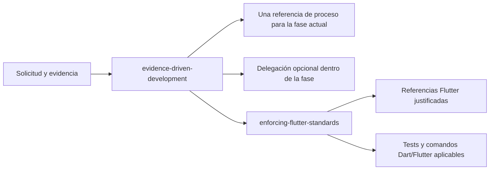

# Evidence-Driven Flutter Engineering

Este repositorio contiene dos Agent Skills base complementarias:

- `evidence-driven-development`: workflow de ingeniería portable y agnóstico
  del stack;
- `enforcing-flutter-standards`: extensión de dominio para Flutter y Dart.

Seis entry skills delgadas mejoran la activación de widget tests, integration
tests, diagnóstico de layout, localización, widget previews y navegación. Cada
una compone las dos skills base y selecciona una sola receta temática.

La primera posee los modos, fases, diagnóstico, diseño, aprobación, auditoría,
TDD, delegación segura, verificación, changelog y contratos de reporte. La
segunda descubre evidencia Flutter y aporta decisiones temáticas, tipos de
tests y comandos Dart/Flutter. Una regla general tiene un único dueño.

## Cómo se componen



El workflow mantiene un registro efímero con `mode`, `scenario`, `phase`,
evidencia de selección, proceso actual y diferido, y skills de dominio. Es
interno por defecto. Si el usuario lo pide, se muestra sólo ese schema seguro.

La carga es progresiva por fase:

| Fase actual | Referencia general |
|---|---|
| Reproducir o diagnosticar | `diagnose.md` |
| Diseñar, delimitar o aprobar | `design-and-approve.md` |
| Auditar o revisar feedback/diffs | `audit-and-review.md` |
| Implementar un batch aprobado | `test-first-change.md` |
| Revisar diff y verificar | `verify-and-complete.md` |
| Formatear el informe final | `report-contracts.md` |
| Coordinar líneas independientes cuando aporte beneficio | `delegation-and-concurrency.md` |

No se anticipan referencias de implementación, cierre o reporte. Una respuesta
intermedia no activa por sí sola el contrato de reporte. La delegación se carga
sólo cuando hay capacidad y al menos dos líneas independientes; no cambia la
fase, el alcance aprobado ni la propiedad final del coordinador.

## Dependencia obligatoria de Flutter

`enforcing-flutter-standards` requiere `evidence-driven-development` para toda
auditoría, review, diagnóstico, planificación, implementación o finalización.
Si la skill general no está disponible, Flutter informa el bloqueo y no
improvisa un workflow local.

La única excepción es una decisión técnica Flutter estrictamente read-only que
no inspecciona código o diffs, no diagnostica un bug, no propone un refactor ni
planifica o cierra una implementación.

## Entry skills por tarea

Los entrypoints no poseen TDD, aprobación, verificación ni políticas Flutter.
Declaran como dependencias las dos skills base, bloquean con un mensaje
accionable si falta alguna y delegan la fase al workflow general.

| Predicado focalizado | Entry skill | Receta seleccionada |
|---|---|---|
| Interacción, harness, `WidgetTester` o pump | `flutter-widget-testing` | `widget-testing.md` |
| Flujo completo, plugin o target real | `flutter-integration-testing` | `integration-testing.md` |
| Overflow, constraints o sizing | `flutter-layout-diagnostics` | `layout-diagnostics.md` |
| ARB, locale, plural o `l10n.yaml` | `flutter-localization` | `localization.md` |
| `@Preview`, wrapper o limitación native/web | `flutter-widget-previews` | `widget-previews.md` |
| Ruta, redirect, deep link o navegación anidada | `flutter-navigation` | `navigation.md` |

Una solicitud Flutter genérica conserva las skills base sin forzar un
entrypoint. Un entrypoint tampoco anticipa recetas vecinas por conveniencia.

## Estándares Flutter

La extensión aplica referencias temáticas sólo desde evidencia observable:

| Área | Referencia |
|---|---|
| Arquitectura, dominio, Cubit/Bloc, Freezed, barrels | `architecture-and-state.md` |
| Paquetes, SDKs, lifecycle y dependencias | `packages-and-integrations.md` |
| HTTP, DTOs, excepciones y failures | `networking-and-errors.md` |
| Preferencias, secretos locales y bases de datos | `persistence.md` |
| Navigator, rutas, deep links y redirects | `navigation.md` |
| Logging, observabilidad, flavors y configuración | `security-and-environments.md` |
| Selección del nivel de test, pruebas Dart, codegen y cobertura | `flutter-quality.md` |
| Interacciones y harnesses de widget test | `widget-testing.md` |
| Flujos reales, plugins y targets de integración | `integration-testing.md` |
| Overflows, constraints e inspector de layout | `layout-diagnostics.md` |
| ARB, locales y generación l10n | `localization.md` |
| Widget Previewer y límites de Chrome/native | `widget-previews.md` |
| UI, responsive, accesibilidad y assets exactos | `ui-implementation.md` |
| Lanzamiento, árbol, semántica, interacción y captura runtime | `runtime-inspection.md` |

El proceso conserva la arquitectura coherente del proyecto, exige evidencia
para decisiones de Cubit/Bloc, usa Freezed para datos o variantes, evita ciclos
entre paquetes, mantiene tipos de vendors fuera de features/estado y no inventa
assets personalizados faltantes. En presentation exige estados renderizables
exhaustivos, fallos y acciones de recuperación propios, valores seleccionables
válidos, interacción asíncrona coherente, adaptación por restricciones y
semántica dinámica verificada. Dependencias y migraciones requieren comparación,
plan y aprobación separados.

## Fuente desplegable

```text
.agents/skills/
├── evidence-driven-development/
│   ├── SKILL.md
│   ├── agents/openai.yaml
│   └── references/
│       ├── audit-and-review.md
│       ├── delegation-and-concurrency.md
│       ├── design-and-approve.md
│       ├── diagnose.md
│       ├── report-contracts.md
│       ├── test-first-change.md
│       └── verify-and-complete.md
├── enforcing-flutter-standards/
│   ├── SKILL.md
│   ├── agents/openai.yaml
│   ├── references/
│   │   ├── architecture-and-state.md
│   │   ├── flutter-quality.md
│   │   ├── integration-testing.md
│   │   ├── layout-diagnostics.md
│   │   ├── localization.md
│   │   ├── navigation.md
│   │   ├── networking-and-errors.md
│   │   ├── packages-and-integrations.md
│   │   ├── persistence.md
│   │   ├── runtime-inspection.md
│   │   ├── security-and-environments.md
│   │   ├── source-catalog.json
│   │   ├── ui-implementation.md
│   │   ├── widget-previews.md
│   │   └── widget-testing.md
│   └── scripts/inspect_flutter_project.dart
├── flutter-integration-testing/{SKILL.md,agents/openai.yaml}
├── flutter-layout-diagnostics/{SKILL.md,agents/openai.yaml}
├── flutter-localization/{SKILL.md,agents/openai.yaml}
├── flutter-navigation/{SKILL.md,agents/openai.yaml}
├── flutter-widget-previews/{SKILL.md,agents/openai.yaml}
└── flutter-widget-testing/{SKILL.md,agents/openai.yaml}
```

## Fuentes, políticas y compatibilidad

`references/source-catalog.json` registra el tema, autoridad, URL, fecha de
verificación, aplicabilidad y versión de cada fuente. Las entradas
`official` enlazan documentación primaria de Flutter; las entradas
`project-policy` identifican decisiones propias como Bloc/Cubit, Freezed, Dio,
Drift o los contratos de aprobación. Una política no se presenta como
recomendación oficial.

Cada referencia activa contiene un marcador `provenance` cuyos IDs se aplican
a todas sus decisiones normativas, salvo que una decisión declare un marcador
más específico. `not-version-bound` sólo es válido con una justificación. La
compatibilidad vigente se declara en el frontmatter de la skill y en el
catálogo, sin fijar un modelo de IA concreto.

Al cambiar una regla o cuando cambie la versión documentada de Flutter, la URL
o la autoridad, revalidá las entradas afectadas, actualizá `verifiedOn` y
ejecutá:

```bash
dart run skill-evals/enforcing-flutter-standards/source_catalog_test.dart
```

## Instalación

Las carpetas canónicas versionadas viven en el catálogo del repositorio y Codex
las descubre automáticamente:

```text
.agents/skills/evidence-driven-development/
.agents/skills/enforcing-flutter-standards/
.agents/skills/flutter-widget-testing/
.agents/skills/flutter-integration-testing/
.agents/skills/flutter-layout-diagnostics/
.agents/skills/flutter-localization/
.agents/skills/flutter-widget-previews/
.agents/skills/flutter-navigation/
```

Para usarlas en todos los repositorios, instalalas en `~/.agents/skills/`.
Codex admite symlinks, por lo que se puede enlazar cada carpeta canónica y
recibir sus cambios sin borrar ni volver a copiar. Evitá mantener otra copia con
el mismo `name`, porque Codex no las fusiona y puede mostrar ambas. Consultá la
[documentación oficial de skills](https://developers.openai.com/codex/skills).

Codex detecta actualizaciones automáticamente; reinicialo si un cambio no
aparece. La invocación implícita se activa cuando la solicitud coincide con el
`description`. La invocación explícita sigue disponible cuando se quiere forzar
el flujo:

```text
Use $evidence-driven-development with $enforcing-flutter-standards to plan and
verify this Flutter change.

Use $flutter-widget-testing to add a focused Flutter widget interaction test.
```

Copiar sólo la skill Flutter deja los workflows generales bloqueados por la
dependencia faltante. No hay dependencias MCP, assets ni scripts de runtime en
la skill general.

## Inspector Flutter

El inspector Dart es read-only y reúne inventario mecánico: raíces Flutter,
paquetes locales y ciclos, archivos grandes, barrels, capas, tests, changelogs,
análisis y comandos detectables. No emite hallazgos arquitectónicos por sí solo.

Resumen inicial:

```bash
dart run .agents/skills/enforcing-flutter-standards/scripts/inspect_flutter_project.dart \
  --root /ruta/al/proyecto --format summary
```

Expansión focalizada:

```bash
dart run .agents/skills/enforcing-flutter-standards/scripts/inspect_flutter_project.dart \
  --root /ruta/al/proyecto --format json \
  --section packageEdges --section cycles
```

## Inspección runtime por capacidades

Cuando una tarea necesita ejecutar u observar la app, la skill descubre primero
las capacidades disponibles y las mapea a lanzamiento, target, árbol o layout,
semántica, interacción, logs y captura. No presupone un servidor MCP, emulador,
navegador ni herramienta concreta.

El registro identifica entrypoint, flavor, dispositivo o plataforma,
dimensiones, estado inicial, acciones y evidencia obtenida. Con capacidades
parciales declara el alcance faltante; sin capacidades runtime conserva el
trabajo estático independiente y deja una validación manual pendiente. Toda
interacción que pueda mutar datos externos o ser destructiva requiere una
aprobación específica.

## Recetas operativas Flutter

Las recetas de widget tests, integration tests, diagnóstico de layout,
localización y previews se cargan de forma independiente cuando existe su
predicado observable. Cada una comienza por preservar comandos, harnesses,
configuración y dependencias del repositorio; luego aporta activación, pasos,
errores frecuentes y verificación. Navegación añade deep links, stacks anidados
y validación diferenciada para Android, iOS y web.

Los comandos documentados son candidatos versionados, no defaults universales.
La skill deriva primero los comandos reales del proyecto. No introduce
`flutter_driver`, MVVM, `go_router`, paquetes de localización, herramientas de
integración ni dependencias de previews sin evidencia, comparación y aprobación.

## Evaluación y verificación

- G1–G14 validan routing, planificación, baseline TDD, protección de `main`,
  delegación y comportamiento de la skill general.
- F1–F15 validan composición base, dependencia faltante, referencias Flutter,
  auditorías de estado y recetas focalizadas.
- F16–F24 validan entrypoint único, composición obligatoria, bloqueo por
  dependencia, ausencia de activación genérica y contexto temático mínimo.
- F25–F28 validan runtime completo, parcial y ausente, además del gate de
  aprobación para interacciones con impacto externo.
- `context_budget_test.dart` valida budgets y ausencia de contratos legacy.
- `inspect_flutter_project_test.dart` cubre las diez interfaces del inspector.

Comandos principales:

```bash
dart format --output=none --set-exit-if-changed .agents/skills skill-evals tool
dart run tool/validate_skills.dart
dart run skill-evals/evidence-driven-development/context_budget_test.dart
dart run skill-evals/enforcing-flutter-standards/source_catalog_test.dart
dart run skill-evals/enforcing-flutter-standards/inspect_flutter_project_test.dart
dart run skill-evals/skills-quality/skills_quality_test.dart
git diff --check
```

Los escenarios y scorecards activos viven bajo `skill-evals/`. La documentación
histórica permanece fuera de las rutas vigentes y no es ejecutable.

## CI de calidad de skills

`.github/workflows/skills-quality.yml` ejecuta en cada push o pull request que
afecta las skills, sus evaluaciones o su documentación exactamente los comandos
anteriores. El workflow usa Dart 3.12.2, permisos de lectura, credenciales de
checkout no persistentes y actions fijadas por SHA completo.

`tool/validate_skills.dart` comprueba que cada carpeta activa tenga `SKILL.md` y
`agents/openai.yaml`, que `name` y `description` sean válidos y que los links
Markdown locales de las skills y del README resuelvan. Los fixtures bajo
`skill-evals/skills-quality/fixtures/` demuestran los fallos de metadata y links.

El linter externo permanece fuera de este batch y requiere una comparación y
aprobación separadas.

## Documentación vigente

- [Diseño de la extracción](docs/specs/2026-07-31-evidence-driven-development-design.md)
- [Plan ejecutado](docs/plans/2026-07-31-evidence-driven-development.md)
- [Resumen de arquitectura](docs/design.md)
- [Resumen de implementación](docs/implementation-plan.md)
- [Changelog](CHANGELOG.md)
