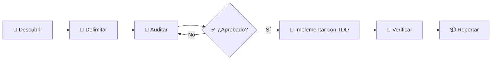

# Public README Implementation Plan

> **For agentic workers:** REQUIRED SUB-SKILL: Use superpowers:subagent-driven-development (recommended) or superpowers:executing-plans to implement this plan task-by-task. Steps use checkbox (`- [ ]`) syntax for tracking.

**Goal:** Create a visual-professional GitHub README in Spanish that explains the repository, the Flutter engineering skill, and both Dart files with accurate usage examples.

**Architecture:** Keep the deliverable in one root `README.md` because it is the repository entry point and has one documentation responsibility. Build the narrative from the canonical skill and current Dart implementation, using badges, one Mermaid flow, concise tables, and copyable commands without adding assets or dependencies.

**Tech Stack:** GitHub Flavored Markdown, Mermaid, Agent Skills metadata, Dart CLI.

## Global Constraints

- Create `README.md` as the product deliverable and add one concise entry to
  the existing canonical `CHANGELOG.md`.
- Write the README in clear, approachable, technically precise Spanish.
- Use emojis, badges, tables, and one Mermaid diagram without saturating the document.
- Do not modify the skill, references, Dart scripts, evaluation artifacts, or dependencies.
- Do not claim releases, published coverage, a license, or verified compatibility that the repository does not evidence.
- Describe the inspector as deterministic, read-only mechanical evidence rather than an architectural verdict.
- Document both `.dart` files and distinguish the runtime inspector from its dependency-free executable test suite.
- Because this is documentation without behavior, record the documentation-only no-test predicate and validate paths, commands, Markdown, Mermaid, whitespace, and claims.

---

## File Map

- Create: `README.md` — public GitHub landing page, usage guide, architecture overview, and source map.
- Modify: `CHANGELOG.md` — concise `Unreleased > Added` entry for the new public README.
- Read only: `.agents/skills/enforcing-flutter-standards/SKILL.md` — canonical orchestration behavior.
- Read only: `.agents/skills/enforcing-flutter-standards/references/*.md` — detailed policy boundaries.
- Read only: `.agents/skills/enforcing-flutter-standards/scripts/inspect_flutter_project.dart` — documented inspector implementation.
- Read only: `skill-evals/enforcing-flutter-standards/inspect_flutter_project_test.dart` — documented executable test harness.

### Task 1: Create and verify the public README

**Files:**

- Create: `README.md`
- Reference: `docs/superpowers/specs/2026-07-29-readme-design.md`

**Interfaces:**

- Consumes: the current repository structure, the `enforcing-flutter-standards` Agent Skill, the Dart inspector CLI, and its executable tests.
- Produces: a root GitHub README with stable relative links and commands runnable from the repository root.

- [x] **Step 1: Reconfirm the documentation-only predicate**

Run:

```bash
git status --short
rg --files --hidden -g '!.git/**' | sort
```

Expected:

- the only pre-existing uncommitted implementation artifact is this plan;
- `README.md` does not already exist;
- no source behavior will be changed, so RED/GREEN does not apply.

- [x] **Step 2: Create the hero and repository summary**

Create `README.md` with:

- `# 🛡️ Enforcing Flutter Standards`;
- a one-sentence value proposition explaining that this is a portable Agent Skill for evidence-backed Flutter and Dart engineering;
- static `for-the-badge` Shields badges for Agent Skill, Flutter standards, and the Dart inspector;
- a short “¿Qué es?” section;
- a blockquote explaining that the skill does not blindly rewrite projects: it discovers conventions, audits evidence, requests approval, and verifies approved changes.

Do not add release, coverage, build-status, package-version, or license badges.

- [x] **Step 3: Explain the workflow and operating modes**

Add `## 🔄 Cómo trabaja` with this Mermaid flow:



Follow it with a three-row table for:

- Auditoría: read-only evidence, findings, and approvable batches.
- Implementación: exact approved scope, TDD when behavior changes, and fresh verification.
- Revisión: actionable findings for diffs, commits, pull requests, or incoming feedback without implicit mutation.

- [x] **Step 4: Summarize the enforced standards**

Add `## 🎯 Qué estándares cubre` as compact bullets or a two-column table covering:

- architecture and domain purity;
- Cubit versus Bloc from observable event semantics;
- Freezed for data and variant types;
- deliberate barrels and acyclic local packages;
- owned boundaries for vendor SDKs;
- networking, typed failures, and safe result consumption;
- persistence decisions for Shared Preferences, secure storage, Hive, Drift, and ObjectBox;
- navigation and environment preservation;
- UI assets, responsiveness, accessibility, and visual validation;
- TDD, changelog handling, secrets, and fresh verification.

Keep each description to one or two sentences and avoid implying that every conditional technology is mandatory.

- [x] **Step 5: Document the skill anatomy**

Add `## 🧩 Anatomía de la skill` with a table linking these exact paths and responsibilities:

- `.agents/skills/enforcing-flutter-standards/SKILL.md`
- `.agents/skills/enforcing-flutter-standards/agents/openai.yaml`
- `.agents/skills/enforcing-flutter-standards/references/engineering-standards.md`
- `.agents/skills/enforcing-flutter-standards/references/audit-contract.md`
- `.agents/skills/enforcing-flutter-standards/references/ui-implementation.md`
- `.agents/skills/enforcing-flutter-standards/references/standalone-workflow.md`
- `.agents/skills/enforcing-flutter-standards/references/superpowers-integration.md`

State that Superpowers is optional and that the standalone workflow preserves the same Flutter-specific gates when it is unavailable.

- [x] **Step 6: Explain both Dart files**

Add `## 🔍 Dart bajo el capó` with two subsections.

For `.agents/skills/enforcing-flutter-standards/scripts/inspect_flutter_project.dart`, document that it:

- uses only `dart:convert` and `dart:io`;
- accepts `--root DIRECTORY` and `--format text|json`;
- resolves the canonical root and traverses deterministically without following directory symlinks;
- skips Git, tool caches, build outputs, hidden directories except recognized CI folders, and generated Dart outputs;
- discovers Flutter roots, local path-dependency edges, cycles, large non-generated Dart files, barrels, feature layers, tests, changelogs, analysis options, and project-command sources;
- reports schema version `1`;
- gathers evidence without modifying the inspected project or judging its architecture.

For `skill-evals/enforcing-flutter-standards/inspect_flutter_project_test.dart`, state that it:

- is a dependency-free executable Dart test harness;
- builds temporary synthetic workspaces;
- checks JSON and text output, exclusions, path parsing, deterministic ordering, local dependency edges, cycle enumeration, and CLI error handling;
- leaves the production inspector untouched.

- [x] **Step 7: Add installation and runnable examples**

Add `## 🚀 Uso` explaining that compatible agents consume the canonical folder:

```text
.agents/skills/enforcing-flutter-standards/
```

Explain both supported distribution shapes without inventing a client-specific
path:

- project-local use keeps the complete folder under `.agents/skills/`;
- global use copies the complete folder to the skills directory supported by
  the compatible agent.

Show the explicit invocation:

```text
$enforcing-flutter-standards
```

Add commands runnable from the repository root:

```bash
dart run .agents/skills/enforcing-flutter-standards/scripts/inspect_flutter_project.dart \
  --root /ruta/a/tu/proyecto \
  --format text
```

```bash
dart run .agents/skills/enforcing-flutter-standards/scripts/inspect_flutter_project.dart \
  --root /ruta/a/tu/proyecto \
  --format json
```

```bash
dart run skill-evals/enforcing-flutter-standards/inspect_flutter_project_test.dart
```

Clarify that agents without filesystem or command access can interpret the rules but cannot complete evidence-backed inspection or implementation.

- [x] **Step 8: Explain evaluation artifacts and repository layout**

Add:

- `## 🧪 Cómo se evaluó`, linking the behavior scenarios and scorecard, and explaining normal plus delivery-pressure evaluations without claiming a perfect result;
- `## 🗂️ Estructura del repositorio`, with a compact tree containing `.agents/`, `docs/`, `skill-evals/`, `CHANGELOG.md`, and `README.md`;
- `## 📚 Documentación`, linking `docs/design.md`, `docs/implementation-plan.md`, the README design spec, and `CHANGELOG.md`.

- [x] **Step 9: Verify every documented command**

Before verification, add this line under `CHANGELOG.md` → `Unreleased` →
`Added`:

```markdown
- Added a public GitHub README for the Flutter engineering skill and its Dart inspector.
```

Run:

```bash
dart run .agents/skills/enforcing-flutter-standards/scripts/inspect_flutter_project.dart --root . --format text
dart run .agents/skills/enforcing-flutter-standards/scripts/inspect_flutter_project.dart --root . --format json
dart run skill-evals/enforcing-flutter-standards/inspect_flutter_project_test.dart
```

Expected:

- both inspector commands exit `0` and print schema `1` inventory;
- the executable test suite exits `0` with every case passing.

- [x] **Step 10: Verify paths, Markdown structure, and scope**

Run:

```bash
test -f README.md
test -f .agents/skills/enforcing-flutter-standards/SKILL.md
test -f .agents/skills/enforcing-flutter-standards/scripts/inspect_flutter_project.dart
test -f skill-evals/enforcing-flutter-standards/inspect_flutter_project_test.dart
test -f docs/design.md
test -f docs/implementation-plan.md
test -f docs/superpowers/specs/2026-07-29-readme-design.md
test -f CHANGELOG.md
rg -n '^# |^## |```mermaid|flowchart LR|dart run ' README.md
rg -n 'public GitHub README' CHANGELOG.md
git diff --check
git status --short
git diff -- README.md CHANGELOG.md
```

Expected:

- all referenced local files exist;
- the hero, required sections, Mermaid block, and Dart commands are present;
- `git diff --check` exits `0`;
- only `README.md`, `CHANGELOG.md`, and this implementation-plan artifact differ from the last committed state;
- the full README diff contains no unsupported claims or unrelated edits.

- [ ] **Step 11: Commit the README and implementation plan**

Run:

```bash
git add README.md CHANGELOG.md docs/superpowers/plans/2026-07-29-public-readme.md
git commit -m "docs: add public repository readme"
```

Expected: one documentation commit containing the root README and its execution plan.
